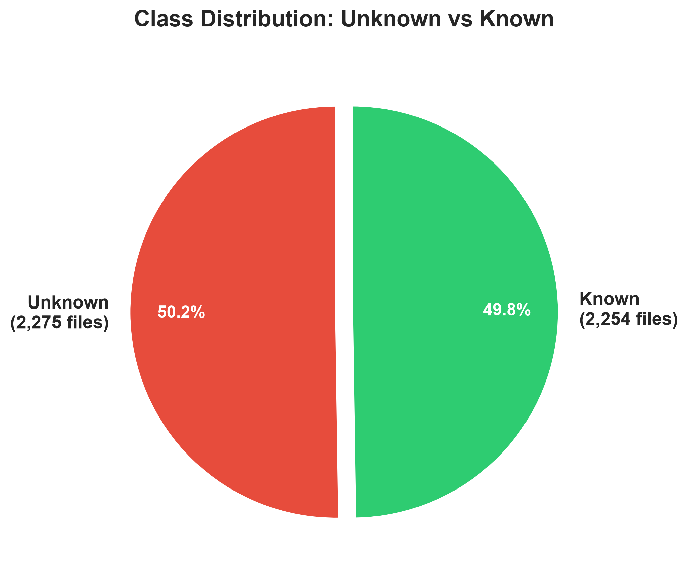
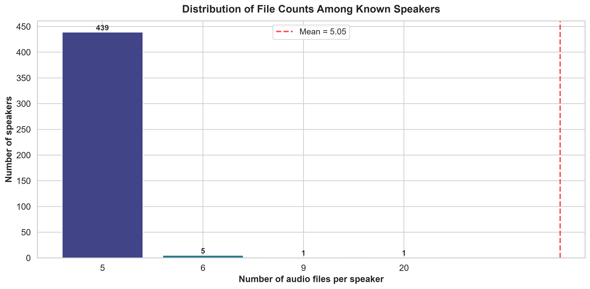

# Phase 0 — Exploratory Data Analysis Report

**Project:** IAAA Competition 2026 — Open-Set Speaker Identification  
**Date:** 2026-07-16  
**Branch:** `feature/dataEDA`

---

## 1. Data Loading & Cleaning

| Metric | Value |
|--------|-------|
| Raw rows loaded | 4,529 |
| Missing values | 0 |
| Duplicate rows | 0 |
| Duplicate audio files | 0 |
| Rows after cleaning | 4,529 |

---

## 2. Dataset Statistics

### Global Counts

- **Total audio files** : **4,529**
- **Unique known speakers (UUIDs)** : **446**
- **Audio files for `"unknown"` class** : **2,275** (50.23%)
- **Audio files for known classes** : **2,254** (49.77%)

### Per-Known-Speaker Distribution

| Statistic | Value |
|-----------|-------|
| Minimum files per speaker | 5 |
| Maximum files per speaker | 20 |
| Mean files per speaker | 5.0538 |
| Median files per speaker | 5.0 |
| Standard deviation | 0.7416 |

### Speaker Frequency Breakdown

| Files per speaker | Number of speakers |
|-------------------|-------------------:|
| 5 | 439 |
| 6 | 5 |
| 9 | 1 |
| 20 | 1 |

### Imbalance Ratio

$$
\text{Imbalance Ratio} = \frac{\text{Unknown files}}{\text{Mean files per known speaker}}
= \frac{2275}{5.0538}
= 450.1553
$$

---

## 3. Visualisations

### 3.1 Class Distribution — Unknown vs Known

### 3.2 Distribution of Files Among Known Speakers

---

## 4. Analysis & Implications for Model Training

The dataset exhibits a **moderate class imbalance** between the `unknown` (OOD) class and the known-speaker classes:

- **2,275 samples (50.2%)** belong to the single `"unknown"` class (class **0**).
- The remaining **2,254 samples (49.8%)** are spread across **446 known speakers**.
- The **Imbalance Ratio** is **450.16**, meaning the unknown class has roughly **450.2×** as many samples as the average known speaker.
- Among known speakers, the distribution is **almost perfectly balanced**: the majority of speakers have exactly **5** samples, with only minor deviations.

### Key Challenges

1. **Open-Set Nature:** The model must not only classify 446 known speakers but also reliably detect OOD samples as class `0`. A naïve argmax over the softmax output will tend to over-confidently assign known labels to OOD samples.
2. **Imbalance at Class Level:** The `unknown` class is over-represented relative to individual known speakers. Without mitigation, the model may become biased toward predicting `unknown`.
3. **Balanced Among Known Speakers:** The known speakers are nearly uniformly distributed, which is favourable — no sub-sampling or re-weighting is needed *within* the known set.

### Recommended Strategies

| Strategy | Rationale |
|----------|-----------|
| **Weighted Cross-Entropy Loss** | Assign a higher weight to known-speaker classes and a slightly lower weight to the `unknown` class to counteract the imbalance, or use inverse-class-frequency weighting for the 448-class problem. |
| **Focal Loss** | Apply focal loss (Lin et al., 2017) to down-weight easy samples and focus training on hard-to-classify and OOD examples — well suited for open-set problems. |
| **Oversampling / Undersampling** | Since the known-speaker side is already well balanced, consider **undersampling** the `unknown` class during training and controlling OOD detection via an uncertainty threshold. |
| **Two-Head Architecture** | Train one head for known-speaker classification and a separate OOD detector (e.g., an energy-based or Mahalanobis-distance head) — a modern best-practice for open-set recognition. |
| **Data Augmentation** | Use SpecAugment, MixUp, or noise injection to increase effective diversity, especially for speakers with fewer than the modal sample count. |

### Conclusion

The dataset is **highly structured**: known speakers are nearly perfectly balanced, but the OOD (`unknown`) class introduces a **class-level imbalance** with an Imbalance Ratio of **450.16**. A standard cross-entropy loss will likely suffice for known-speaker separation, but explicit **imbalance mitigation** (weighted loss, focal loss, or OOD-specific techniques) is essential for robust open-set performance. The recommended starting point is **Weighted Cross-Entropy** combined with **Focal Loss**, with validation against a held-out OOD set to tune the threshold for `unknown` rejection.

---

*Report generated programmatically via `src/eda.py`.*
