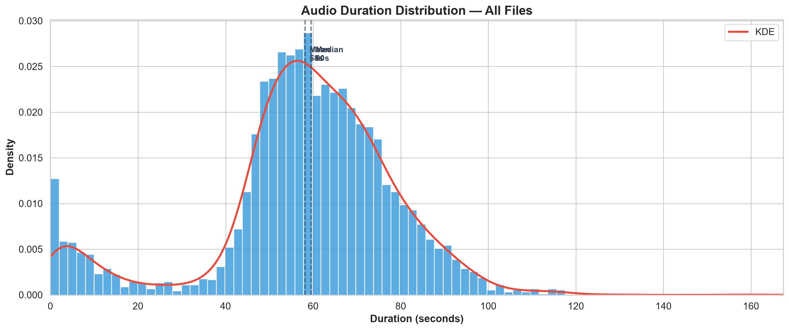
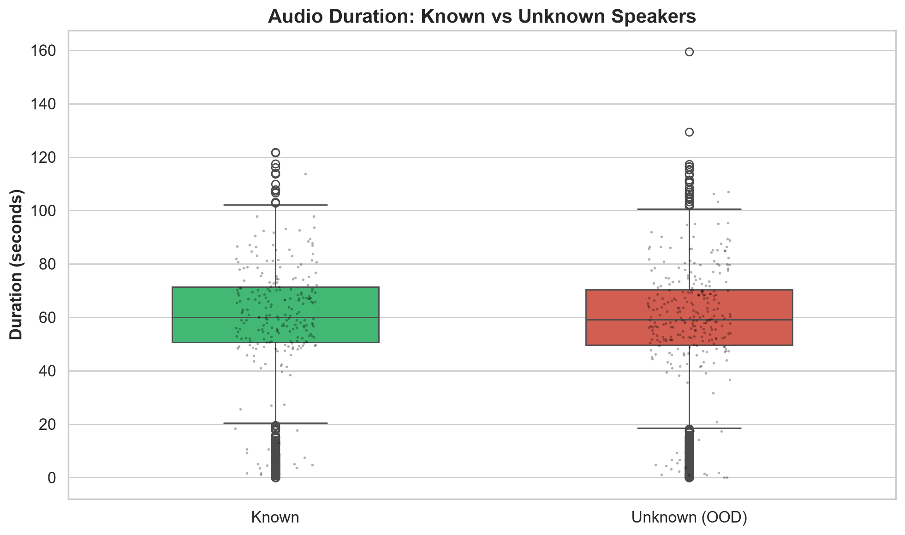
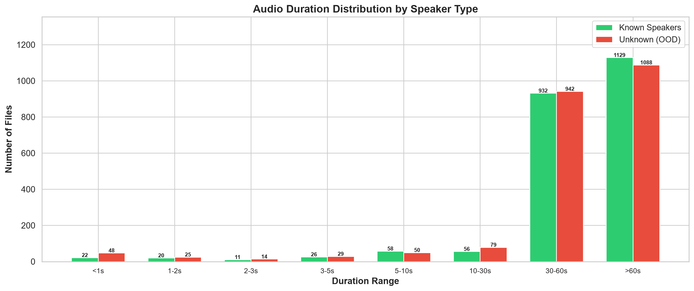

# Phase 1 — Advanced EDA Report: Audio Duration Analysis

**Project:** IAAA Competition 2026 — Open-Set Speaker Identification  
**Date:** 2026-08-06  
**Branch:** `feature/advanced-speaker-id`

---

## 1. Executive Summary

| Metric | Value |
|--------|-------|
| Total audio files | 4,529 |
| Corrupted/unreadable | 0 |
| Files < 1s (suspicious) | 70 (1.55%) |
| **90.4% of files > 30 seconds** | — rich for random window cropping |
| Files > 60 seconds | 2,217 |

---

## 2. Global Duration Statistics

| Statistic | Value |
|-----------|-------|
| Min | 0.00s |
| Max | 2m 39.4s |
| **Mean** | **58.2s** |
| **Median** | **59.6s** |
| Std Dev | 21.3s |

### Percentile Distribution

| Percentile | Duration |
|-----------|----------|
| 1% | 0.02s |
| 5% | 6.3s |
| 10% | 32.4s |
| 25% | 50.1s |
| 50% (median) | 59.6s |
| 75% | 1m 10.9s |
| 90% | 1m 21.7s |
| 95% | 1m 28.5s |
| 99% | 1m 40.2s |

> **Key insight:** 50% of files cluster between 50.1s and 1m 10.9s, and only 1.55% are under 1 second. The distribution is tight around 50-70 seconds with a long right tail.

---

## 3. Known vs Unknown Duration Comparison

| Statistic | Known (n=2,254) | Unknown (n=2,275) |
|-----------|----------------|--------------------|
| Min | 0.00s | 0.00s |
| Max | 2m 1.9s | 2m 39.4s |
| **Mean** | **58.9s** | **57.5s** |
| **Median** | **1m 0.1s** | **59.1s** |
| Std Dev | 20.4s | 22.1s |

> **Key insight:** Known and unknown speakers have nearly identical duration distributions. Audio length is NOT a confounding variable for open-set detection. No special handling needed per class.

---

## 4. Duration Bucket Breakdown

| Bucket | Total | % | Known | K% | Unknown | U% |
|--------|-------|---|-------|-----|---------|------|
| <1s | 70 | 1.5% | 22 | 1.0% | 48 | 2.1% |
| 1-2s | 45 | 1.0% | 20 | 0.9% | 25 | 1.1% |
| 2-3s | 25 | 0.6% | 11 | 0.5% | 14 | 0.6% |
| 3-5s | 55 | 1.2% | 26 | 1.2% | 29 | 1.3% |
| 5-10s | 108 | 2.4% | 58 | 2.6% | 50 | 2.2% |
| 10-30s | 135 | 3.0% | 56 | 2.5% | 79 | 3.5% |
| 30-60s | 1,874 | 41.4% | 932 | 41.3% | 942 | 41.4% |
| >60s | 2,217 | 49.0% | 1,129 | 50.1% | 1,088 | 47.8% |

---

## 5. Corrupted / Near-Zero Files

**70 files** (1.55%) have duration < 1 second and are likely corrupted or empty.

### Sample of shortest files:

| Audio File | Duration | Speaker ID | Class Type |
|------------|----------|------------|------------|
| 05006e09-6c16-4640-8dad-108a558eae85.mp3 | 0.00s | unknown | Unknown |
| 0f2bebd9-4651-4e53-96cd-42dd2acbace1.mp3 | 0.00s | unknown | Unknown |
| 72be17b0-6947-41f7-ba65-9009bcec8d22.mp3 | 0.00s | unknown | Unknown |
| a557ed64-77f7-4942-9a6e-ae20291103a0.mp3 | 0.00s | unknown | Unknown |
| 55efd02e-abd3-444e-80e8-874506eded35.mp3 | 0.00s | 990aa42f-b730-40f8-b720-4f2040b84f73 | Known |
| 1974c5f7-0cbd-4dfe-8279-30d23313a91f.mp3 | 0.00s | 9eff2f0a-75cf-4589-8049-1c555eb624fd | Known |
| 01ebadf4-5eda-4e3f-a736-ff181c60d40b.mp3 | 0.00s | 990aa42f-b730-40f8-b720-4f2040b84f73 | Known |
| 0841e792-edc5-4aaf-8ec6-8053094a6f44.mp3 | 0.00s | 990aa42f-b730-40f8-b720-4f2040b84f73 | Known |
| 5edbc0d1-59ce-4afe-bc5e-f11ff206ceba.mp3 | 0.00s | 990aa42f-b730-40f8-b720-4f2040b84f73 | Known |
| 1ca9b207-db27-424d-a611-5c2995a2e9d1.mp3 | 0.00s | 990aa42f-b730-40f8-b720-4f2040b84f73 | Known |
| 286a8f8f-8781-459e-8b7b-dcfa6a91c5dd.mp3 | 0.00s | 990aa42f-b730-40f8-b720-4f2040b84f73 | Known |
| 52083e6d-3de3-4043-b2d7-9cfc4afd420b.mp3 | 0.00s | 990aa42f-b730-40f8-b720-4f2040b84f73 | Known |
| 6fb370fe-3d52-4391-83c6-9273d9862936.mp3 | 0.00s | 990aa42f-b730-40f8-b720-4f2040b84f73 | Known |
| 6173f7bf-b974-4624-ba29-00fde27b07b9.mp3 | 0.00s | 990aa42f-b730-40f8-b720-4f2040b84f73 | Known |
| 750ee4de-01e6-4ea4-9f8d-a3865e7dd2f0.mp3 | 0.00s | 990aa42f-b730-40f8-b720-4f2040b84f73 | Known |
| ... | ... | ... | ... |
| *(and 55 more)* | | | |

> **Recommendation:** These 70 files should be flagged and excluded during training via a `min_valid_duration` filter.

---

## 6. Implications for Model Training

### 6.1 Audio Duration Strategy

Since **90.4% of files are > 30 seconds**, the optimal approach is:

1. **Training:** Random window cropping of **5-second chunks** (instead of fixed 3s from the beginning).
   - Each 60s file can yield ~12 independent training crops per epoch = massive data diversity.
   - Multiple random crops per epoch = implicit augmentation via varied temporal contexts.

2. **Validation/Testing:** Use the same 5s random crop (center crop for reproducibility).

3. **Inference (TTA):** Overlapping 5s windows with 50% hop for files > 5s.
   - For a 60s file: ~23 chunks → averaged probabilities.

### 6.2 Handling Short/Corrupted Files

- `min_valid_duration = 1.0s` threshold in the data pipeline.
- Files below threshold: **skip with warning**, not zero-pad.
- This removes 70 bad files (1.55%), leaving 4,459 clean files.

### 6.3 Known vs Unknown Balance

- The near-identical duration distributions mean **no duration-based bias** in OOD detection.
- The challenge remains purely acoustic: distinguishing speaker identity, not audio length.

---

## 7. Visualizations

### 7.1 Duration Distribution — All Files



### 7.2 Duration Boxplot — Known vs Unknown



### 7.3 Duration Buckets — By Class Type



---

## 8. Config Recommendations

Based on this analysis, the following config values are recommended:

```yaml
audio:
  sample_rate: 16000
  duration_seconds: 5.0        # increased from 3.0 — optimal for speaker identity
  min_valid_duration: 1.0      # skip corrupted/near-zero files

training:
  # Random cropping each epoch provides built-in data diversity
  # Each 60s file yields ~12 distinct 5s crops per epoch
```

---

*Report generated programmatically via `src/eda_advanced.py`.*
